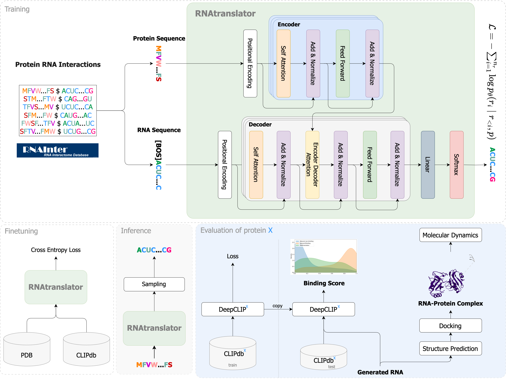

<h1 align="left" style="color:#00aa55">🌿 RNAtranslator</h1>
<h3 align="left">Modeling protein-conditional RNA design as sequence-to-sequence natural language translation</h3>

[](https://www.biorxiv.org/content/10.1101/2025.03.04.641375v1)
[](https://huggingface.co/SobhanShukueian/rnatranslator)
---

## Overview

**RNAtranslator** is a generative language model that redefines RNA design as a **sequence-to-sequence translation problem**, treating proteins and RNAs as "languages." By learning from **millions of protein-RNA interactions**, RNAtranslator directly generates **novel RNA sequences** with:

- High binding affinity  
- Structural and functional similarity to natural RNAs  
- No need for post-generation optimization  

This innovation opens new frontiers in **RNA therapeutics**, especially for **undruggable proteins**, and unlocks powerful tools for **synthetic biology**. The RNAtranslator model uses an encoder–decoder transformer architecture. During training, the encoder is provided with the target protein sequence while the decoder learns to regenerate the binding RNA sequence. At inference, the model takes a protein sequence as input and generates candidate RNA sequences by sampling from the learned distribution.


<div align="center">
  
</div>


---

## Key Features

- **Sequence-to-Sequence Translation:** Reformulates RNA design as a natural language translation problem.
- **Encoder-Decoder Transformer:** Utilizes a transformer-based architecture for modeling protein–RNA interactions.
- **Large-Scale Training:** Initially trained on 26 million RNA–protein interactions (RNAInter dataset) and fine-tuned on 12 million experimentally validated interactions.
- **Direct RNA Generation:** Generates RNA sequences conditioned on a target protein sequence without additional optimization.
- **Multi-GPU Support:** Training is accelerated using [Hugging Face Accelerate](https://huggingface.co/docs/accelerate).

---

## Table of Contents

- [Installation](#installation)
- [Features](#key-features)
- [File & Folder Structure](#file--folder-structure)
- [Usage Manual](#usage-manual)
  - [Training](#training)
  - [Generation](#generation)
  - [Evaluation](#evaluation)
- [Usage Examples](#usage-examples)
- [Citations](#citations)
- [License](#license)
- [Contact](#contact)

---

## Installation

RNAtranslator is implemented in Python and uses PyTorch along with Hugging Face Accelerate for distributed training. We recommend using Conda to manage dependencies.

### Requirements

Create a dedicated Conda environment using the provided YAML file:

```bash
conda env create --name rnatranslator -f environment.yml
conda activate rnatranslator
```

## File & Folder Structure

```
rnatranslator/
├── main.py                 # Main entry point to dispatch training, generation, or evaluation.
├── train.py                # Training procedure.
├── generate.py             # RNA generation procedure.
├── evaluate.py             # Evaluation procedure.
├── environment.yml         # Conda environment file.
├── hyps/                   # YAML files with training and model hyperparameters.
│   ├── train.yaml
│   └── t5.yaml
├── src/                    # Source code for models, data handling, and utilities.
│   ├── models/
│   ├── data/
│   └── utils/
└── examples/               # Example inputs and outputs.
    ├── protein.fasta        # Example protein FASTA file.
```
---

## Usage Manual

RNAtranslator supports three main operational modes: training, generation, and evaluation. The main script (`main.py`) dispatches the appropriate procedure based on the selected run mode.

### Training

To train the model, use your preferred accelerator setup to launch the training procedure.
```bash
CUDA_VISIBLE_DEVICES=0,1 accelerate launch --config_file accelerate_config main.py --runmode train --train-hyp ./hyps/train.yaml --model-hyp ./hyps/model.yaml
```

The model uses hyperparameters defined in YAML files, and training logs, as well as checkpoints, are saved under the designated results directory.

### Generation

RNAtranslator generates RNA sequences conditioned on a target protein. You can provide the input either as a protein FASTA file or directly as a protein name and sequence. 

```bash
python main.py --runmode generate --protein-fasta ./examples/protein.fasta --rna_num 500 --max_len 75
```

The generated sequences are stored in the designated inference directory. Adjust generation parameters such as the number of candidates, maximum sequence length, sampling strategy, and beam settings as needed.

### Evaluation

To evaluate the generated RNA sequences and create analysis plots (e.g., binding affinity violin plots, box plots), run the evaluation mode. 
```bash
python main.py --runmode evaluate --eval-dir ./results/validation --rnas_fasta rnas_fasta_dir

```
The evaluation outputs, including figures and metrics, are stored in the specified evaluation directory.

---

## Usage Examples

RNAtranslator has been designed for ease of use. After setting up your environment and configuring hyperparameters, you can run the training, generation, or evaluation modes directly through your preferred interface. Example usage scenarios include:

- **Training:** Launch the training process using your multi-GPU configuration. `./bashes/run_train.sh`
- **Generation:** Generate RNA sequences by providing a target protein (via FASTA file or direct input).  `./bashes/run_generate.sh`
- **Evaluation:** Analyze and visualize the generated RNA sequences using the built-in evaluation scripts.  `./bashes/run_evaluate.sh`

Refer to the project documentation for further details on configuring run modes and parameter settings.

---

## Citations

If you use RNAtranslator in your research, please consider citing our work:
> [Link to preprint](https://www.biorxiv.org/content/10.1101/2025.03.04.641375v1)

---

## License

- **[CC BY-NC-SA 2.0](https://creativecommons.org/licenses/by-nc-sa/2.0/)**
- © [Year] RNAtranslator. For academic use only. For commercial applications, please contact the corresponding authors.

---

## Contact

For questions or comments regarding RNAtranslator, please contact:

- **Sobhan Shukueian Tabrizi:** [shukueian@gmail.com](mailto:shukueian@gmail.com)  

---

*Thank you for using RNAtranslator. We welcome your feedback and collaboration!*
